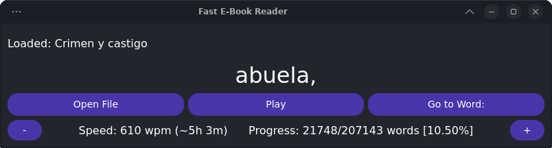

# Fast E-Book Reader
This project implements a simple, fast-paced e-book reader for `.epub` files, designed with PyQt6 for the user interface and functionality to navigate, control playback speed, and track reading progress across sessions.

## Key Features

- **Word-by-Word Display:** Reads text from an `.epub` file and displays it word-by-word at a specified reading speed (Words Per Minute).
- **Customizable Reading Speed:** Users can adjust the reading speed in increments of 10 WPM.
- **Progress Tracking:** Tracks reading progress, allowing users to pick up where they left off.
- **Intuitive Controls:** Start, pause, or change speed using keyboard shortcuts or on-screen controls.
- **Navigation:** Navigate through the e-book with precision, and jump to specific word positions.

## Dependencies

- **Python Modules:**
  - `sys` and `re` (standard libraries for system functions and regex handling).
  - `ebooklib` and `epub` for e-book handling.
  - `BeautifulSoup` from `bs4` for parsing the text.
  - `PyQt6` for GUI components.
  - `book_progress` To handle progress tracking of your collection.
  
Install necessary packages if not already available:
```bash
pip install ebooklib bs4 PyQt6
```

## Main Components

### 1. **GUI Setup (`FastReader` class)**
   - **Labels and Buttons**: Displays controls, current word, and reading progress.
   - **Shortcut Controls**: Key bindings for efficient interaction.
   - **Main Display**: Displays the current word, word count progress, and speed.

### 2. **File Management and Parsing**
   - **Open File**: `open_file` loads an `.epub` file, converting it into plain text for word-by-word display.
   - **Progress Tracking**: Integrates `update_progress` and `get_progress` to manage last-read position and resume.

### 3. **Reading and Playback Control**
   - **Toggle Play/Pause**: `toggle_play_pause` to start or pause playback.
   - **Reading Speed Adjustments**: `change_speed_by` adjusts reading speed.
   - **Text Navigation**: `change_position_by` and `go_to_word` enable movement through the text.

### 4. **UI Appearance**
   - **StyleSheet**: Sets colors, font sizes, and button styles for a clean and consistent look.


	
## Usage

1. **Launch Application**:
   - Run the script using Python:
     ```bash
     python FastReader.py
     ```

2. **Open a Book**:
   - Use the `Open File` button to load an `.epub` file. The file name will display upon loading.

3. **Playback**:
   - Click `Play` to start reading, and `Pause` to stop. 
   - Adjust speed with `+` and `-` buttons or keyboard shortcuts (`p` to increase, `o` to decrease).

4. **Navigation**:
   - Use arrow keys to move forward or backward by one word.
   - Enter a word index manually to jump to a specific location.

5. **Progress Tracking**:
   - Close the app with progress saved automatically for resuming in future sessions.

## Keyboard Shortcuts

- **Space**: Play/Pause
- **p**: Increase speed by 10 WPM
- **o**: Decrease speed by 10 WPM
- **Right Arrow**: Move forward by one word
- **Left Arrow**: Move backward by one word

## Customization

- **Reading Speed**: Adjusted in `words_per_min` variable and can be changed dynamically.
- **UI Adjustments**: Modify the PyQt6 `QStyleSheet` for different button colors, fonts, or layouts as needed.
